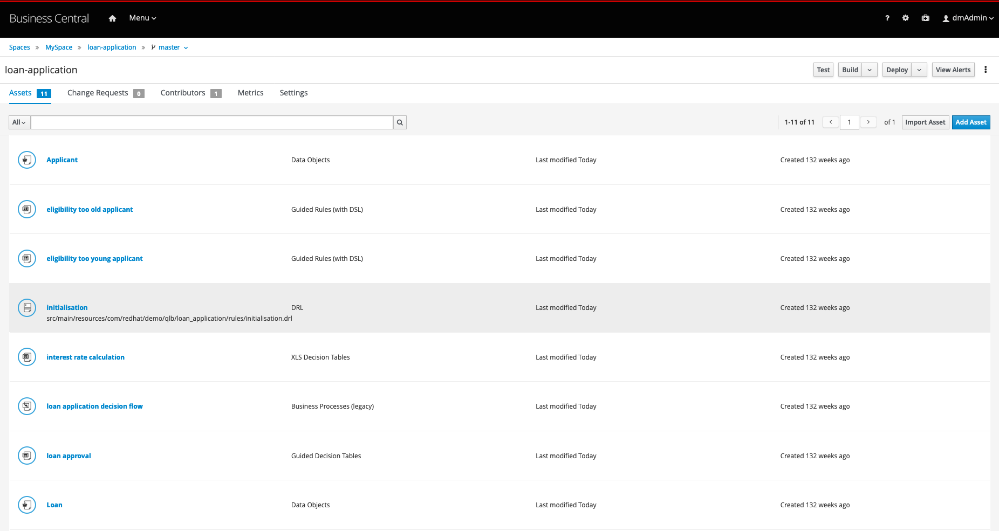
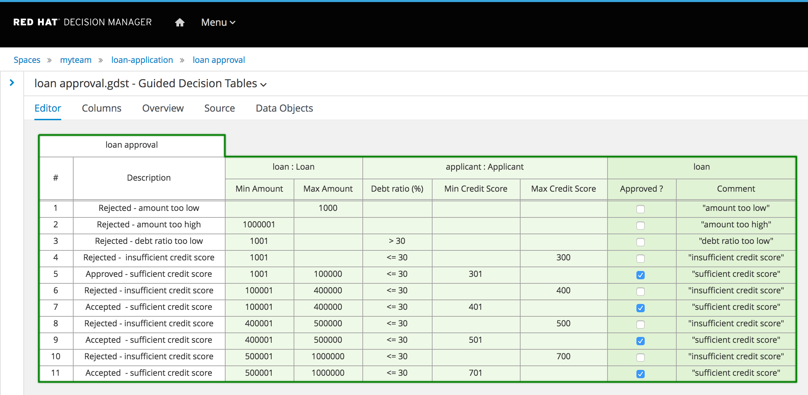
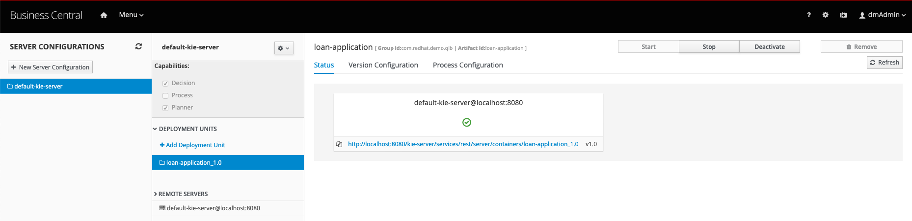
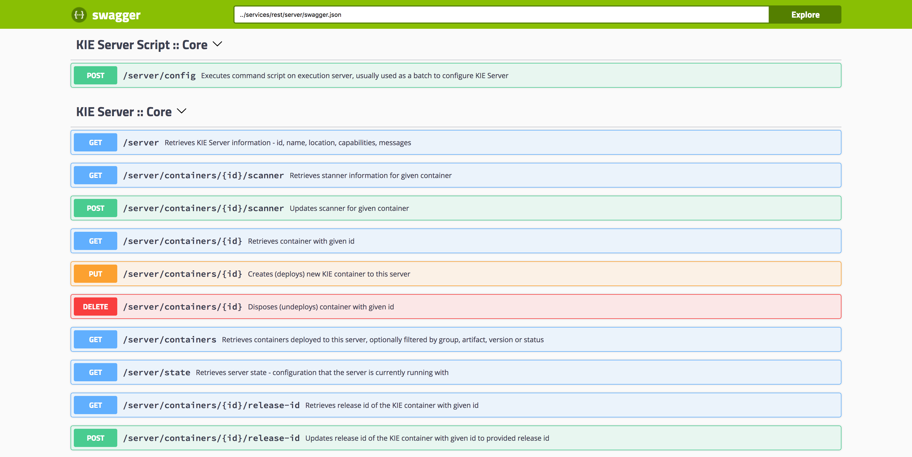
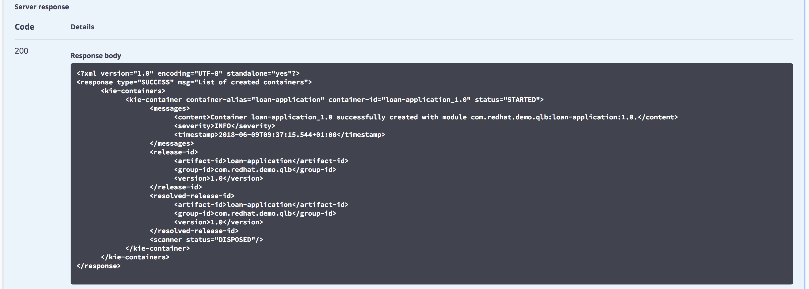

Red Hat Decision Manager Quick Loan Bank Demo
=============================================
This demo project showcases the tooling available in Red Hat Decision Manager implementing 
complex decision logic which can be exposed as a decision service. The Quick Loan Bank in this 
demo uses technical rules, decision tables, guided rules with a Domain Specific Language, and 
Excel decision tables to define its loan calculation and approval system.

You will be given examples of calling the rules as if using them from an application through 
the RestAPI that is exposed by the server. Furthermore, this demo provides a Node.js client 
application written in AngularJS and PatternFly that showcases how web applications can 
consume decision services deployed on the decision server.

You can install this project on your own machine or on an OpenShift Container Platform.


Installing on local machine
---------------------------
1. [Download and unzip.](https://github.com/jbossdemocentral/rhdm7-qlb-loan-demo/archive/master.zip).

2. Add products to installs directory, see installs/README for details and links.

3. Run 'init.sh' or 'init.bat' file. 'init.bat' must be run with Administrative privileges

Follow install output instructions and log in to http://localhost:8080/decision-central  (u:dmAdmin / p:redhatdm1!)

Kie Servier access configured (u: kieserver / p:kieserver1!)

Enjoy installed and configured Red Hat Decision Manager Quick Loan Bank Demo (see below for how to run demo).


Running the demo
----------------
1. Click on the "loan-application" project to open the Loan Application Demo project.

2. The project has simple data model (Loan & Applicant) and single decision table (loan-application) which contains the 
   loan approval rule set.

3. Build and deploy version 1.0 of the project. Click on the "Build and Deploy" in the upper right corner.

4. Go to "Menu -> Deploy -> Execution Servers" repository to see the loan-application_1.0 KIE Container deployed on the 
   Decision Server.

5. The decision server provides a Swagger UI that documents the full RESTful interface exposed by the server 
   at: http://localhost:8080/kie-server/docs

6. In the Swagger UI:
   - navigate to "KIE Server and KIE containers"
   - expand the "GET" operation for resource "/server/containers"
   - click on "Try it out"
   - leave the parameters blank and click on "Execute"
   - when asked for credentials use: Username: kieserver, Password: kieserver1!
   - observe the response, which lists the KIE Containers deployed on the server and their status (STARTED, STOPPED).

7. We can use the Swagger UI to test our Loan Approval Decision Service. In the Swagger UI:
   - navigate to "KIE session assets"
   - expand the "POST" operation for resource "/server/containers/instances/{id}"
   - click on "Try it out"
   - set the "id" parameter to the name of the KIE Container that hosts our rules, in this case `loan-application_1.0`.
   - set "Parameter content type" to `application/json`.
   - set "Response content type" to `application/json`
   - use the following request as the "body" parameter. Note that the `Loan` object has its `approved` attribute set to `false`:
   ```
   {
      "lookup": "default-stateless-ksession",
      "commands": [
         {
            "insert": {
               "object": {
                  "com.redhat.demo.qlb.loan_application.model.Applicant": {
                     "creditScore":410,
                     "name":"Billy Bob",
                     "age":40,
                     "yearlyIncome":90000
                  }
               },
               "out-identifier":"applicant"
            }
         },
         {
            "insert": {
               "object": {
                  "com.redhat.demo.qlb.loan_application.model.Loan": {
                     "amount":250000,
                     "duration":10
                  }
               },
               "out-identifier":"loan"
            }
         },
         {
            "start-process" : {
               "processId" : "loan-application.loan-application-decision-flow",
               "parameter" : [ ],
               "out-identifier" : null
            }
         }
      ]
   }
   ```
   - observe the result. The Quick Loan Bank rules have fired and determined that, based on the credit score of the 
     application, and the amount of the loan, the loan can be approved. The `approved` attribute of the `Loan` has been 
     set to `true`.


Running demo with frontend UI
-----------------------------
1. Navigate to the *support/application-ui/* directory. The installation should have built the UI, but if not, manually 
run the command `npm install` to install the required modules. Start the client application by running `npm start`. This 
will start the NodeJS HTTP server and open the Quick Loan Bank client application in your browser (http://localhost:3000). 
Try to submit a new loan request using the same data as shown the JSON file at above. Try to enter different values to 
see a loan get disapproved, for example, change above applicant age from 40 to 80 for rejectoin based on age.

2. You can change the various rules as desired, change the version of the project, and redeploy a new version to a new 
KIE Container (allowing you to serve multiple versions of the same rule set at the same time on the same decision server). 
You can also build a new version of the project and use the Version Configuration tab of the container definition (in the 
Execution Servers screen) to manage the container using the UPGRADE button to pull the new version.


Installng on OpenShift Container Platform
=========================================
This demo can be installed on Red Hat OpenShift Container Platform in various ways, such as on CodeReady Containers (a local
installaiton of OpenShift Container Platform) or on your own version of OpenShift Container Platform. 

Installing on CodeReady Containers
----------------------------------
TODO: see this demo on RedHatDemoCentral...

Intalling on any OpenShift Container Platform (generic)
-------------------------------------------------------
Options and a guide for installing this demo on your own OpenShift Container Platform are found in the 
[openshift support directory README](support/openshift/README.md).
 

Supporting articles
-------------------

- [Getting Started with Red Hat Decision Manager 7](https://developers.redhat.com/blog/2018/03/19/red-hat-decision-manager-7/)


Released versions
-----------------
See the tagged releases for the following versions of the product:

- v1.4 - Red Hat Decision Manager 7.8.0.GA

- v1.3 - Red Hat Decision Manager 7.7.0.GA

- v1.2 - Red Hat Decision Manager 7.5.0.GA

- v1.1 - Red Hat Decision Manager 7.1.0.GA

- v1.0 - Red Hat Decision Manager 7.0.0.GA














