Red Hat Decision Manager Quick Loan Bank Demo
=============================================

# Intro

This is a demonstration of how a bank can reduce costs and increase customer satisfaction by having quicker responses. In this demonstration, we'll achieve these results improving the loan pre-approval process by automating it's decisioning. It also shows how it is possible to increase the collaboration between the business and technical teams in the process of automating and maintaining the business rules, enabling faster changes and reaction to business needs. 

Red Hat Decision Manager supports the automation of decision in many different ways. Let's see how it's possible to implement business rules through:

- **Guided Rules with Domain Specific Language (DSL)** 
- **Technical Rules (DRL)**
- **Guided Decision TablesExcel Decision Tables**
- **Excel Decision Tables**

We'll see how the loan calculations and approvals can be automated through these assets and how we can do unit testing of these rules through **Test Scenarios**. We'll use **Decision Central** to author and deploy the rules, into the **Decision Engine**, and we'll use a custom front end application to consume the rules deployed in the Decision Engine.

# Technical Details
* This demo runs in Red Hat Decision Manager 7.11. 
* You can either provision it locally in Red Hat EAP, in CRC or on OpenShift Container Platform 4.6;
* In this demo, you will be given examples of calling the rules as if using them from an application through the Rest API that is exposed by the Decision Engine. 
* You'll also have available a Node.js client application written in AngularJS and PatternFly that showcases how web applications can consume decision services deployed on the decision server.

## Installing on local machine

1. [Download and unzip](https://github.com/jbossdemocentral/rhdm7-qlb-loan-demo/archive/master.zip) or [clone this repo](https://github.com/jbossdemocentral/rhdm7-qlb-loan-demo.git).
2. Download and add products below to installs directory ( refer to [installs/README](installs/README) for more details ).
    * [Red Hat Enterprise Application Platform zip file (jboss-eap-7.3.0.zip)](https://developers.redhat.com/download-manager/file/jboss-eap-7.3.0.zip)
    * [Decision Central deployable (rhdm-7.11.0-decision-central-eap7-deployable.zip](https://developers.redhat.com/products/red-hat-decision-manager/download)
    * [Decision Server (KIE Server) deployable (rhdm-7.11.0-kie-server-ee8.zip)](https://developers.redhat.com/products/red-hat-decision-manager/download)
3. Run 'init.sh' or 'init.bat' file. 'init.bat' must be run with Administrative privileges (_node12 required_)

Follow the install output instructions and log in to Decision Central. 

- Decision Central: http://localhost:8080/decision-central  (u:dmAdmin / p:redhatdm1!)
- Kie Server Swagger UI:  http://localhost:8080/kie-server/docs :  (u: kieserver / p:kieserver1!)

Enjoy installed and configured Red Hat Decision Manager Quick Loan Bank Demo (see below for how to run demo).


## Running the demo

1. Click on the "loan-pre-approval" project to open the Loan Application Demo project.

    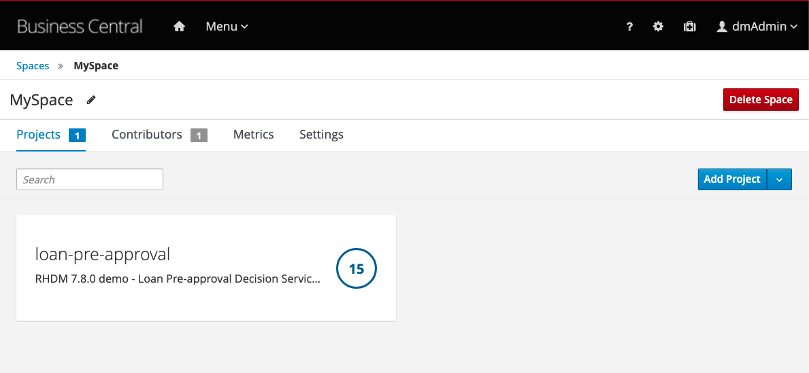

2. About the project:

    * The project has simple data models (Loan & Applicant) and a decision flow (decision-flow.bpmn) which shows how the groups of rules are logically triggered in order to come out with a loan pre approval. 

      * Applicant Data Model:

      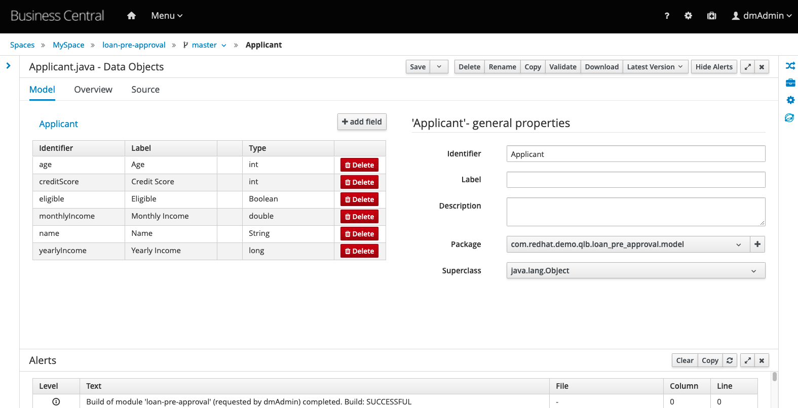

      * Decision Flow:

      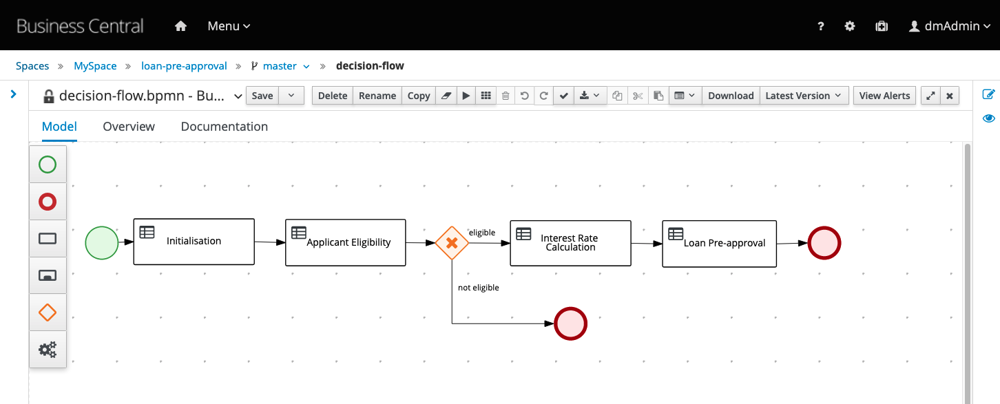

    * In the decision-flow, notice how each node in the diagram relates to a "`ruleflow-group`". 

      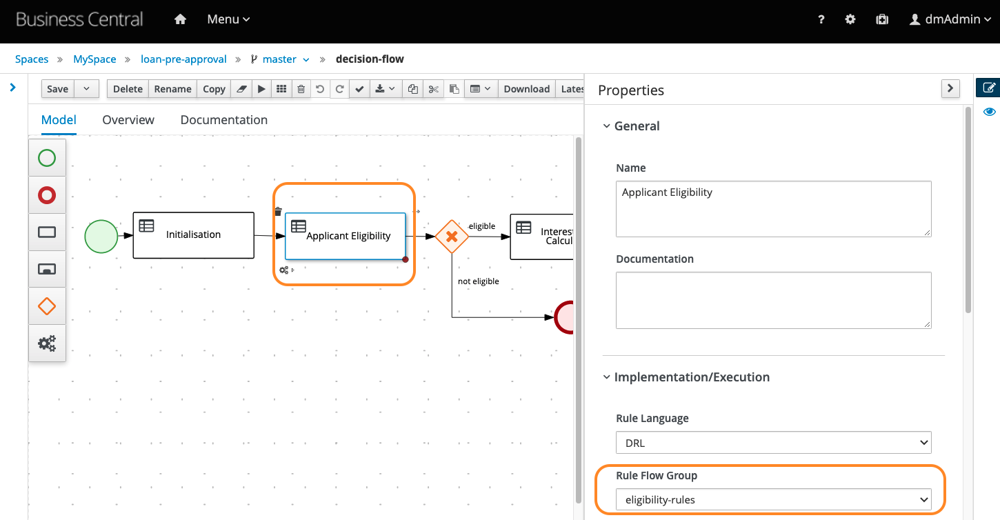

    * Based on this parameter the engine knows which sets of rules to trigger, even if these rules are written in different files (notice how the set of rules identified by the `ruleflow-group`  "eligibility-rules" are defined in the Guided Rules (with DSL) files, for example `eligibility-too-young-applicant` .

    * The rules authored in these rules, are written using Domain Specific Language. You can check the definition of this DSL in the file `dsl-definition`.

      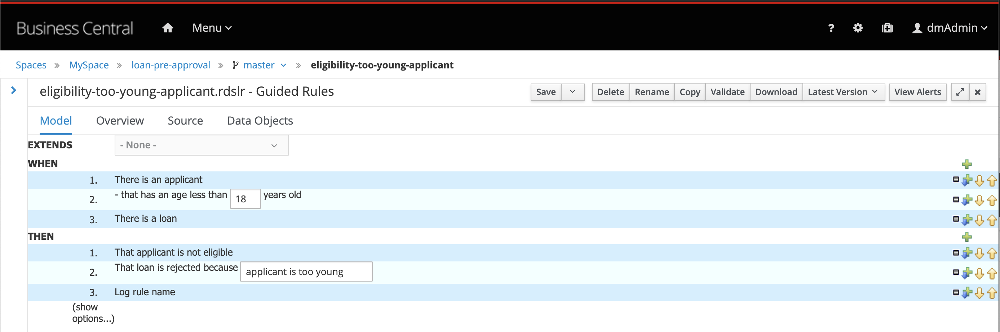

    * Now, open the file `interest-rate-calculation` which has a set of rules written with XLS. Download the file and take a look at it. 
      * You'll notice there are rules based on the minimum and maximum ammount of loan and the time the applicant intends to pay this loan (7,10,15,20 and 25 years). Depending on these conditions, the output will be the respective 
        "Interest Rate %".
        
        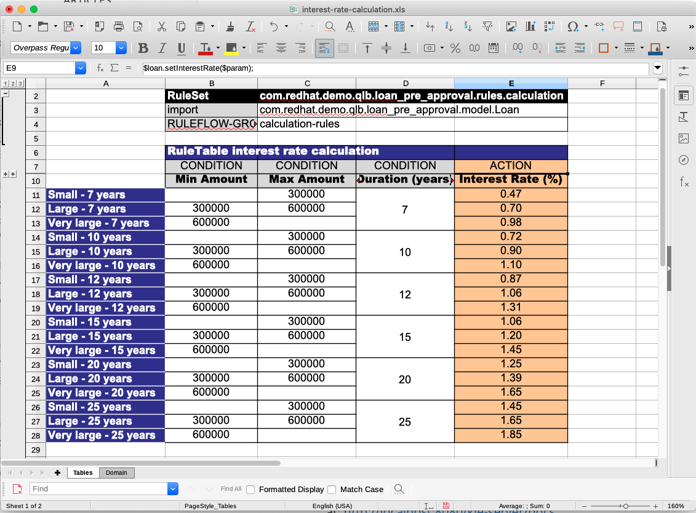
        
      * Notice how these rules are part of the ruleflow-group "calculation-rules", which will be invoked in a different part of the decision-flow.
      
    * The rules implemented using RHDM can be tested, for example, by using a "Test Scenario".  Besides allowing you to write features in an intuitive way, the Test Scenario feature, generates a Test Report and allows you to validate which rules are being fired based on the inputs you provide. You will also be able to validate the test coverage of your rules.

      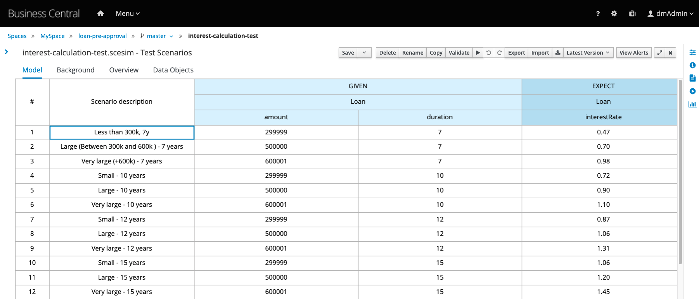

3. Click on the "Deploy" in the upper right corner to build and deploy version 1.0 of the project. 

    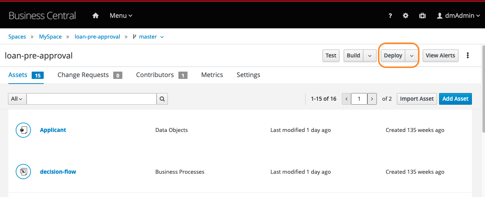

4. In the success message, click on "View Deployment Details". You should see the loan-pre-approval KIE Container deployed on the Decision Server.

    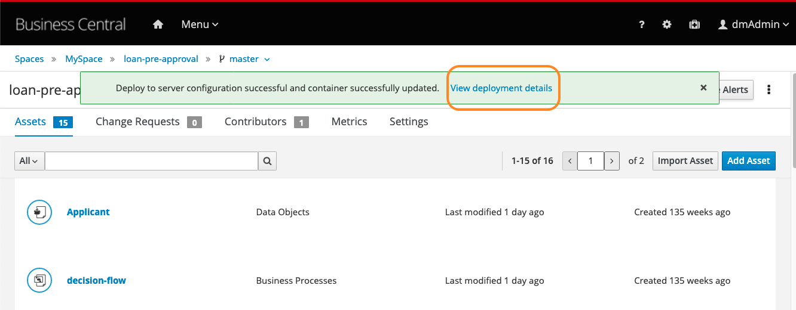

### Testing the deployed application using the Decision Server REST API

1. The decision server provides a Swagger UI that documents the full RESTful interface exposed by the server 
   at: http://localhost:8080/kie-server/docs

2. In the Swagger UI:

   - navigate to "KIE Server and KIE containers"
   - expand the "GET" operation for resource "/server/containers"
   - click on "Try it out"
   - leave the parameters blank and click on "Execute"
   - when asked for credentials use: Username: kieserver, Password: kieserver1!
   - observe the response, which lists the KIE Containers deployed on the server and their status (STARTED, STOPPED).

   - We can use the Swagger UI to test our Loan Pre Approval Decision Service. In the Swagger UI:
   - navigate to "KIE session assets"
   - expand the "POST" operation for resource "/server/containers/instances/{id}"
   - click on "Try it out"
   - set the "id" parameter to the name of the KIE Container that hosts our rules, in this case `loan-pre-approval`.
   - set "Parameter content type" to `application/json`.
   - set "Response content type" to `application/json`
   - use the following request as the "body" parameter. Note that the `Loan` object has its `approved` attribute set to `false`:

   ```
   {
      "lookup": "default-stateless-ksession",
      "commands": [
         {
            "insert": {
               "object": {
                  "com.redhat.demo.qlb.loan_pre_approval.model.Applicant": {
                     "creditScore":410,
                     "name":"Billy Bob",
                     "age":40,
                     "yearlyIncome":90000
                  }
               },
               "out-identifier":"applicant"
            }
         },
         {
            "insert": {
               "object": {
                  "com.redhat.demo.qlb.loan_pre_approval.model.Loan": {
                     "amount":250000,
                     "duration":10
                  }
               },
               "out-identifier":"loan"
            }
         },
         {
            "start-process" : {
               "processId" : "loan-pre-approval.decision-flow",
               "parameter" : [ ],
               "out-identifier" : null
            }
         }
      ]
   }
   ```
   - observe the result. The Quick Loan Bank rules have fired and determined that, based on the credit score of the 
     application, and the amount of the loan, the loan can be approved. The `approved` attribute of the `Loan` has been 
     set to `true`. 
   - In the json request above, try changing the Applicant age from 40 to 10. Execute the request again. You should see the message explaining why the Loan was not approved.


### Running demo with frontend UI

1. In your terminal navigate to the `support/application-ui/` directory. The installation should have built the UI, but if not, manually run the command `npm install` to install the required modules. 
2. Start the client application by running `npm start`.  This will start the NodeJS HTTP server and open the Quick Loan Bank client application in your browser (http://localhost:3000). 

1. Try to submit a new loan request using the same data as shown the JSON file at above. Try to enter different values to 
    see a loan get disapproved, for example, change above applicant age from 40 to 15 for rejection based on age.

    


#### Changing rules with no downtime

Demonstrate how simple it is to update and deploy a business rules.

1. Ask for a Loan (either using the rest api or the frontend ui) with the following parameters. The Loan should be approved.
   
    * Name: Billy Bob
    * Age: 17
    * Credit Score: 410
    * Yearly Income: 90000
    * Loan Amount: 250000
    * Duration: 10
    
2. Open Business Central in another tab, open the project "loan-pre-approval", and open the rule `eligibility-too-young-applicant`.  Change the minimum age to 18. **Save** and close the file.
3. Deploy the project again by clicking the `Deploy` button.
4. Open the QLB UI frontend application, and simply submit the form again without changing the data or reloading the page. You should see the new rules are already in use.
    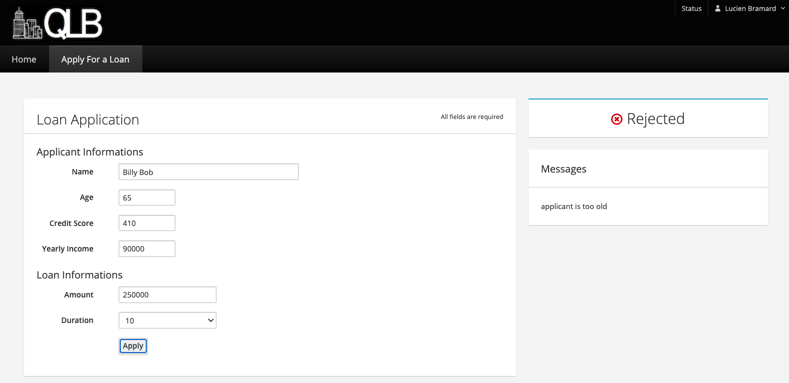


Installing on OpenShift Container Platform (CodeReady Containers)
---------------------------------------------------------------
Install this demo on your local machine using an OpenShift Container Platform development cluster can be done using 
CodeReady Continers. It's fully automated and delivers a fully functioning container-native development experience:

  [CodeReady Containers Quick Loan Bank Demo](https://gitlab.com/redhatdemocentral/crc-quick-loan-bank-demo)

Installing on any OpenShift Container Platform (generic)
-------------------------------------------------------
This demo can be installed on your own version of OpenShift Container Platform. Detailed options and guidance can be found in the [openshift support directory README](support/openshift/README.md).

Once connected to your cluster, move to the `support/openshift/` directory and execute:
`$ ./init-openshift.sh`

Supporting articles and videos
-------------------

- [Getting Started with Red Hat Decision Manager 7](https://developers.redhat.com/blog/2018/03/19/red-hat-decision-manager-7/)
- [Video - Red Hat Decision Manager Install Demo](https://youtu.be/7Vpf9i1yJXU)


Released versions
-----------------
See the tagged releases for the following versions of the product:

- v1.7 - Red Hat Decision Manager 7.11.0.GA

- v1.6 - Red Hat Decision Manager 7.10.0.GA

- v1.5 - Red Hat Decision Manager 7.9.0.GA

- v1.4 - Red Hat Decision Manager 7.8.0.GA

- v1.3 - Red Hat Decision Manager 7.7.0.GA

- v1.2 - Red Hat Decision Manager 7.5.0.GA

- v1.1 - Red Hat Decision Manager 7.1.0.GA

- v1.0 - Red Hat Decision Manager 7.0.0.GA

Extra images
-----------------

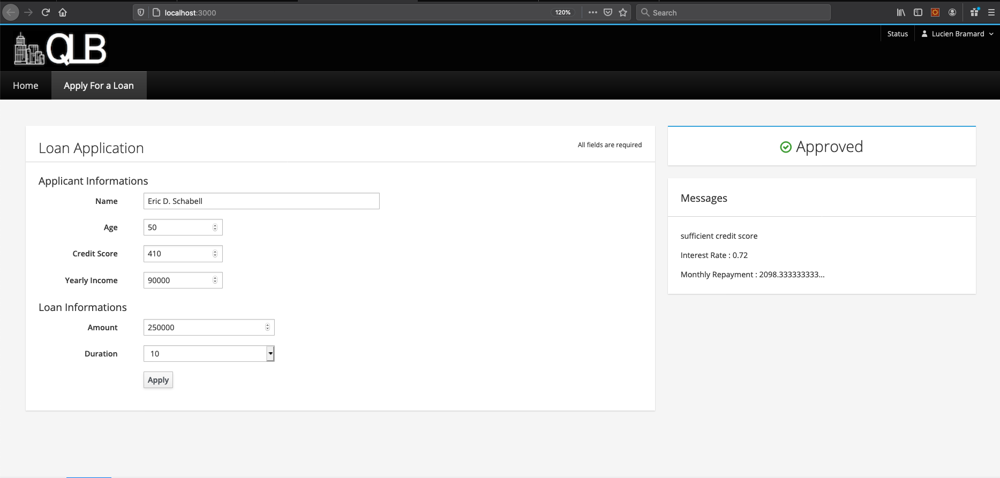

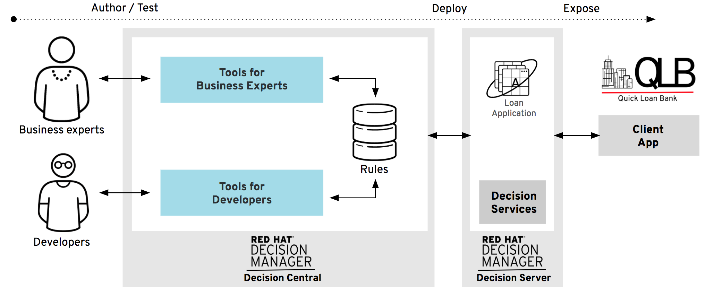

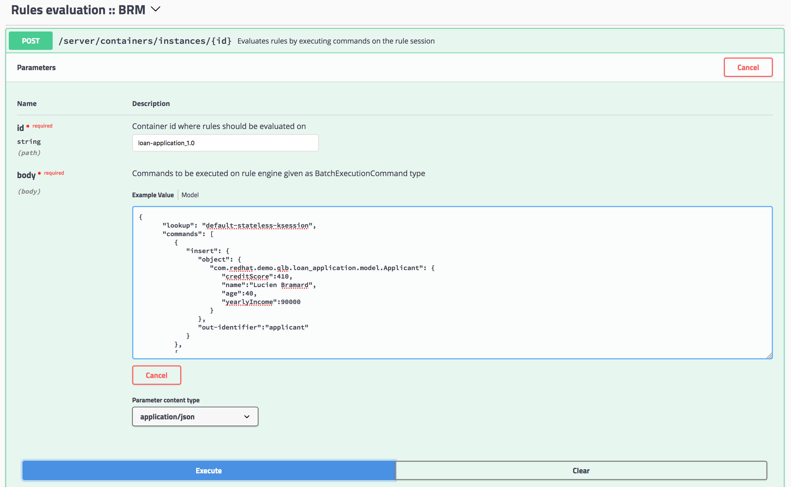

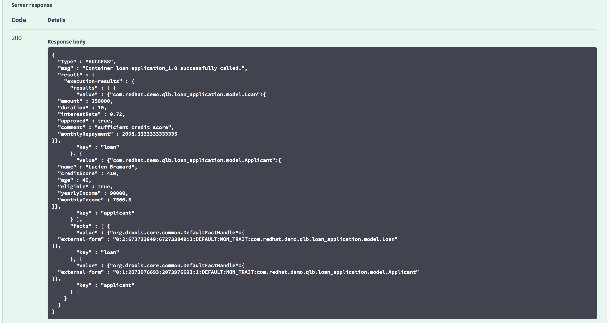
