:scrollbar:
:data-uri:
:toc2:

= Red Hat Decision Manager 7
== Quick Loan Bank Demo - Walkthrough

After your environment has been provisioned to RHPDS, you can login to the OpenShift environment using the details provided by RHPDS.

Once you’ve logged into the OpenShift environment, open the “RHDM7 Quick Loan Bank Demo” project. It could be that the project is still building and deploying containers if you login quickly after the environment has been provisioned. In that case, wait until all 3 pods (Decision Central, Decision Server and the Client Application) have been deployed.

You will see the “Overview” screen with 2 Applications and 3 Pods.

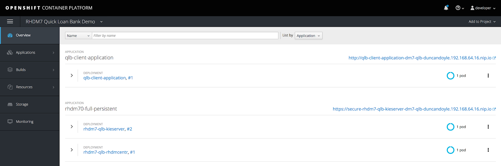

[start=1]
. Expand the `rhdm7-qlb-rhdmcentr` Pod and click on the `http` route on the right hand side of the screen. This should bring you to the Decision Central login screen.
. Login with username *dmAdmin* and password *redhatdm1!*. The Decision Central HomePage will be opened.
+
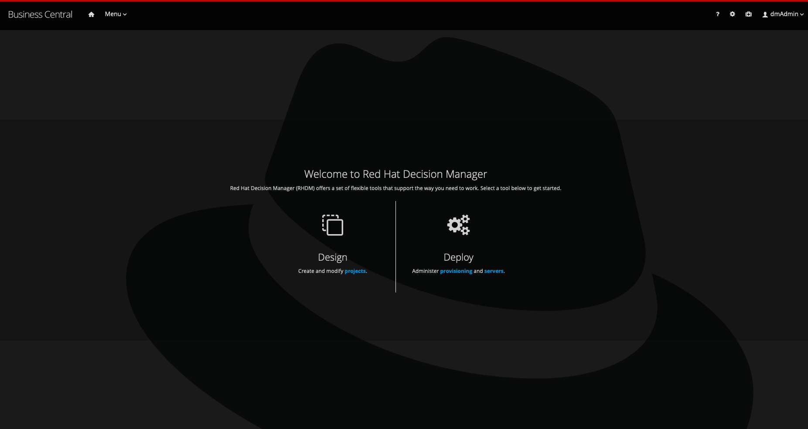
. In the Home Page, click on the *Design* icon to navigate to the project library.
. Click on the *Import Project* button, enter the following Repositoy URL, https://github.com/jbossdemocentral/rhdm7-qlb-loan-demo-repo, and click *Import*.
. Select the `loan-application` project by clicking on the tile, and click the *OK* button in the upper right corner to import the project into Decision Central.
. After you get the message that the import has been successful, you will automatically navigate to the project (this can take a couple of seconds). The platform will now start indexing the project assets (this can also take a bit of time) after which they will be displayed in the project view (if the assets are not displayed, navigate back to the `myteam` Space via the breadcrumbs in the upper left corner and select the `loan-application` project agan).
+
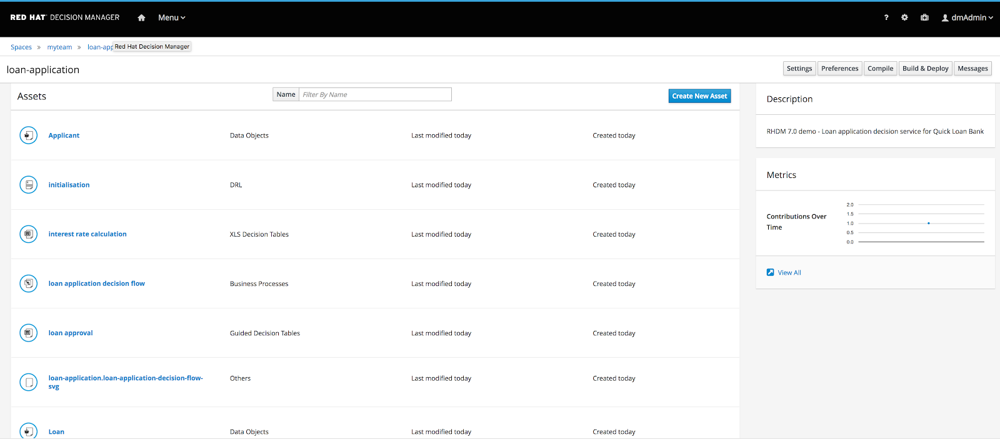
. Click on the *Build and Deploy* button to compile the project and deploy it onto the Decision Server.
. Once the project has been build, navigate to the *Menu -> Deploy -> Execution Servers* screen. This will show the project deployed and running on the Decision Server.
+
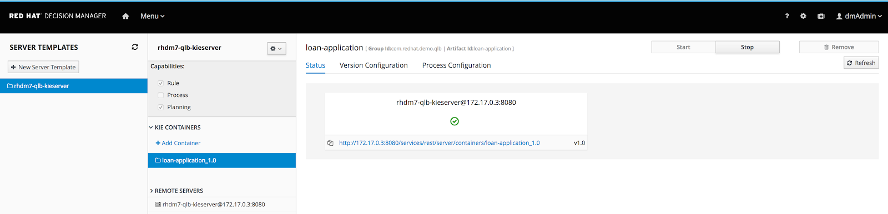
. *OPTIONAL*: To show the powerful RESTful API of Decision Server, one of the key functionalities of our system in cloud-native and modern application development, go back to the OpenShift console. Expand the `rhdm7-qlb-kieserver` Pod and click on the `http` route on the right hand side of the screen. This will open a new browser window and will display the text *Forbidden*. Add `/docs` to the end of the KIE-Server/Decision Server URL in your browser to open the Swagger documentation of our the RESTful API of Decision Server.
+
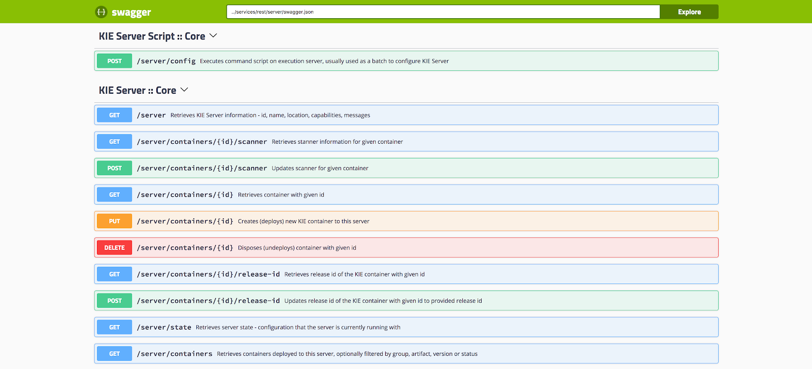
. *OPTIONAL*: Try some of the RESTful APIs. The easiest one to show is the `GET: /server/containers` API in `KIE Server :: Core`. This API will provide information on all the KIE-Containers deployed on the KIE-Server. Click on this, API, click on the *Try it out* button and click on the *Execute* button. The KIE-Server is secured, so you will be asked for credentials. Username: *kieserver*, password: *kieserver1!*. The result shows our `loan_application` container deployed on the server. Explain that this powerful RESTful API allows our platform to run natively in microservices architectures and allows us to integrate with any service, application and/or client that can do REST calls using JSON or XML formats.
+
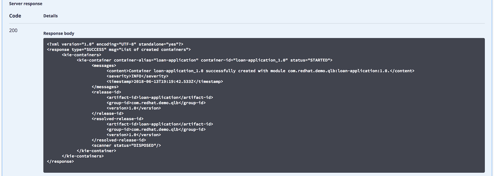
. Navigate back to the OpenShift console. We will now open the AngularJS/PatternFly client application and apply for a Loan. In the Overview page, click on the “http” route of the `qlb-client-application` Pod. This will open a new browser window showing the client app.
+
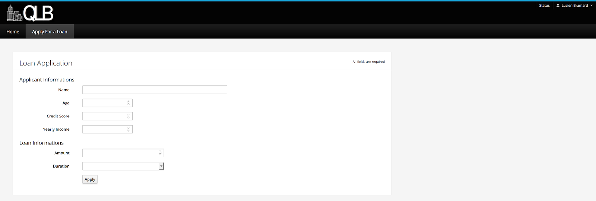
. Fill in the following information:
.. Name: *lskywalker*
.. Age: *52*
.. Credit Score: *650*
.. Yearly Income: *70000*
.. Amount: *15000*
.. Duration: *10*
+
And click on *Apply*. This will fire a RESTful call from the AngularJS/PatternFly Client Application to the Loan Application Decision Service that we have deployed on our Decision Server. The response will be displayed in the UI, and in this case, the loan application will be approved.
+
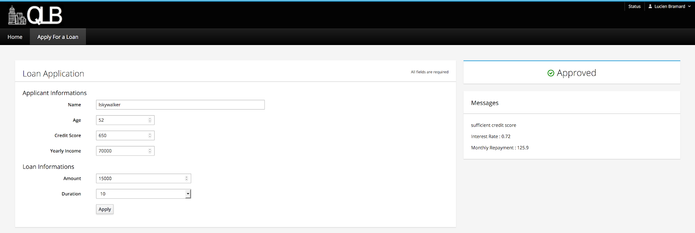
. Add a new loan application that will be rejected. Fill in the following information:
.. Name: *dvader*
.. Age: *71*
.. Credit Score: *400*
.. Yearly Income: *50000*
.. Amount: *30000*
.. Duration: *7*
+
And click on “Apply”. The application will be rejected becase the “applicant is too old”.
+
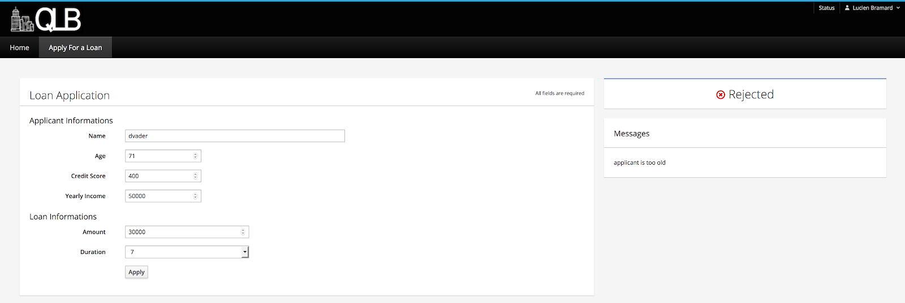
. We will now change the rules so the application that got rejected will now be approved. Navigate back to Decision Central, open the `loan-application` project and open the Guided Rule asset named `too old applicant`. Change the age in the first line from *70* to *75* and click on the *Save* button in the upper right corner. In the confirm window, click *Save* again.
. Click on the `loan-application` breadcrumb in the upper left corner to navigate back to the project screen. In the upper left corner, click on *Settings*. In the settings screen, change the *Version* field to *1.1*. Click on *Save*, and in the confirmation window click on *Save* again.
. In the upper right corner, click on *Build -> Build & Deploy*. In the *Container Id* field, enter the value `loan-application_1.1` and click *OK*. Leave the container-alias the same.
. Go back to the *Execution Server* screen via *Menu -> Deploy -> Execution Servers*. Observe that the `loan-application_1.1` KIE-Container has been deployed onto the Decision Server.
+
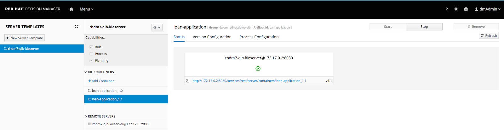
Navigate back to the client application, re-enter the values of step 13 and click on *Apply*. The loan application will now be approved.
+
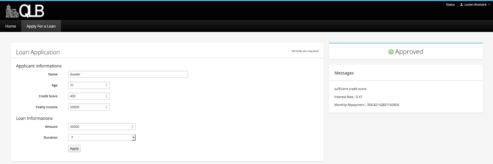
. Note that we still have 2 sets of the rules deployed on the Decision Server, i.e. version *1.0* and version *1.1*. The reason the loan application got approved in the last request was because the client application is accessing the rules via the *Container Alias* and not the *Container ID*. Since the *Container Alias* for both rule containers is the same, Decision Server resolves to the alias to the container with the latest version of our rules.
